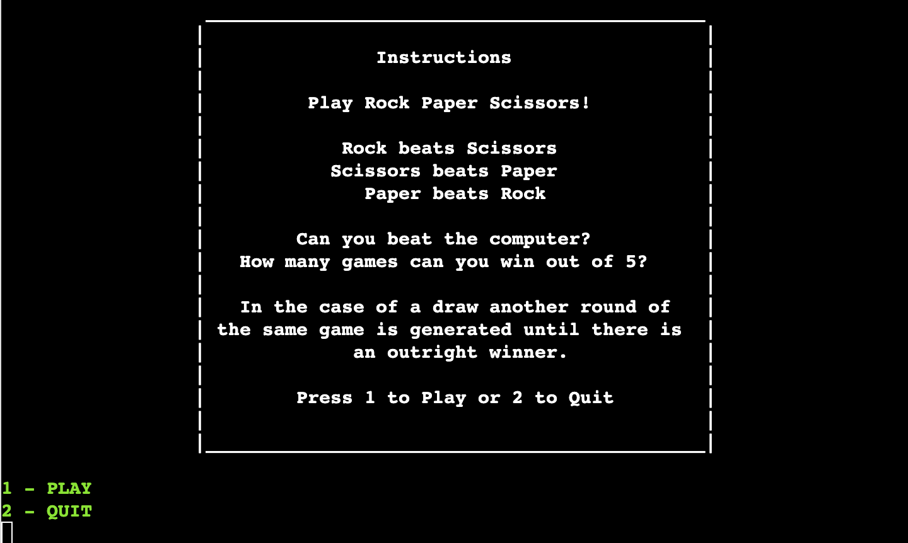
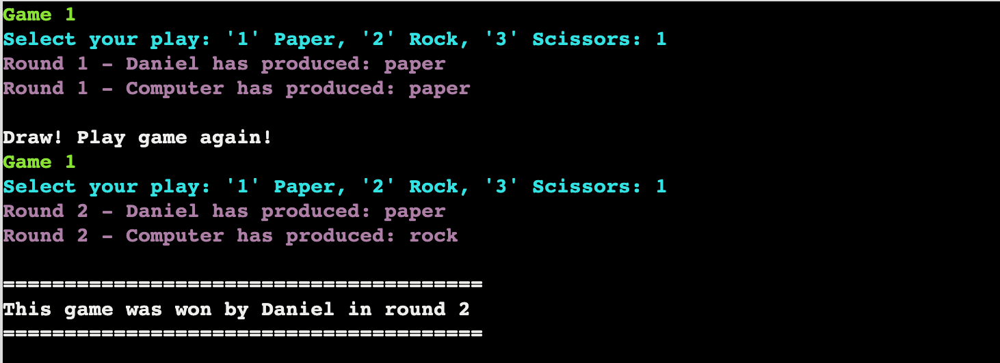
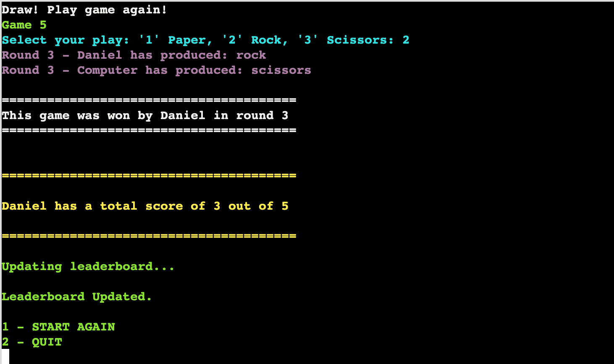
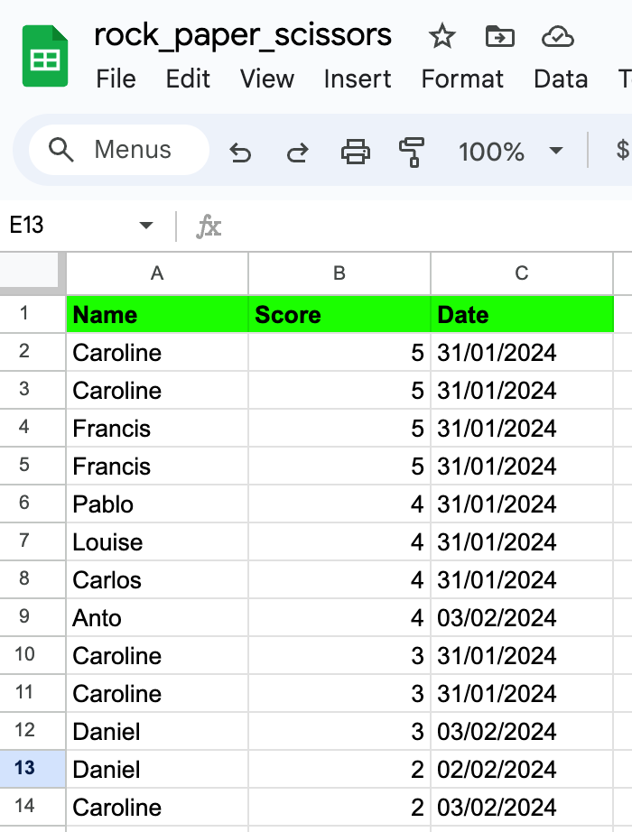

# Rock Paper Scissors
Rock Paper Scissors is a classic two person game. Players start each round by selecting rock, paper or scissors. Rock crushes scissors, scissors cuts paper, and paper covers rock.
In this project the user plays against the computer over five games to see who wins. 

The game is a mixture of luck and logic.

The live link can be found here - [Rock-Paper-Scissors](https://rock-paper-scissors-caro-43b2048bb224.herokuapp.com/)

## How to Play
- The user plays  games of Rock, Paper, Scissors againsts the computer.
- In each game the user can manually select their play (enter 1 for Paper, 2 for Rock and 3 for Scissors)
  - The computer's choice is randomly selected.
  - In the case of a draw i.e. the user and the computer choose the same hand, the game is run again until there is an outright winner.
  - The winner of each game is printed to the terminal.
  - The overall winner after five games have been played is also printed to the terminal.
- The user's score is saved to the leaderboard.

## Site Owner Goals
- To provide the user with a simple game that is both challenging and rewarding.
- To present the user with an app that functions well and is easy to use. 
- To entice the user to return to the game to improve their score.

## User Stories

- ### As a user I want to:
  - Understand the main purpose of the game via the instructions.
  - Be kept engaged throughout with simple graphics/text which show how the game is progressing.
  - Be challenged by trying to beat the computer.
  - See how many games/rounds I have played.
  - Compare my score to others on the leaderboard.
  - Try and beat my score on the leaderboard

## Logic Flow
ADD LUCID FLOW CHART HERE

## Features

### Title and Introduction Section
- When the user enters the site they are greeted with the name of the game and are asked to enter their username. 
- The welcome text was created using Pyfiglet which takes ASCII text and renders it into ASCII art fonts. 

- Once the user enters their name the terminal greets them.
- There is then a three seconds delay before the user is redirected to the options menu.

### Options menu
- The options menu has three possible selections: 1 for Play, 2 for Instructions and 3 for Leaderboard.

- If the user does not input 1, 2 or 3 they will receive an error message asking them to input a valid option.

### Instructions
- If the user presses "2" and enter they will be shown the game instructions. 
- The instructions are surrounded by a box border to make them clear and easy to read. 
- From the instructions menu you can either select play by pressing 1 or quit by pressing 2.

### Leaderboard
- If the user presses "3" and enter they will be taken to the leaderboard. 
- From the leaderboard you can either select play by pressing 1 or quit by pressing 2.

### Game Features
- Once the user selects to play the game, game 1 is launched and the user will be asked to select their hand i.e. Paper, Rock or Scissors:

- When the user selects their hand and presses enter their hand is printed to the terminal.
- The computer's random hand selection is also printed to the terminal.
- Based on the selections made the game will decide who won.
- The winner of each game is surrounded by a white border to make it stand out.

### Guess Input Validation and Error Handling
- If the user inputs anything other than 1, 2 or 3 to select a hand an error message will appear.
  -  The error message reads: 'Please enter "1", "2" or "3".
  - Please see below for some examples:

- In the case of a draw i.e. the user and the computer select the same hand the game will run again until there is an outright winner:

### Guess Feedback
- Once all five games have been played the overall winner will be printed to the terminal.
  - This is printed in yellow to make it stand out:

### Option to Restart or Quit
- Once the game is over the user is informed that the leaderboard has been updated.
- They are then given the option to 1. Start Again or 2. Quit

- Restarting will bring the user back to the login page.
- Quitting will bring the user to a gameover screen. 

### Leaderboard
- The Leaderboard feature was created using Google Sheets. The spreadsheet is accessed by the game through the Google Drive and Google Sheets APIs on the Google Cloud Platform.

- Credentials were generated and provided to allow access from the project to Google Sheets. These were added to the cred.json in the .gitignore file to ensure they weren't pushed to my Github repository. They also had to be added to the Config Vars on Heroku to ensure they could be accessed when running the game. 
- The leaderboard is sorted so that the highest score appears at the top. 

### Future Features
- Improved graphics could be included within the game section for the Rock, Paper, Scissors selections.
- The game could be made more complicated by having Rock, Paper, Scissors, Lizard, Spock which is a more advanced version of the game.
- There could be an option to play either a greater or lessor number of games e.g. 3, 5 or 7 games. 

## Data Model
TO UPDATE THIS SECTION

## Testing

### PEP8 Testing
The python files have all been passed through [PEP8 Online](http://pep8online.com/). All python files were checked with no errors reported. See screen show below:

ADD SCREENSHOT OF PEP8 ONLINE CHECKER

### Input Testing
All user inputs were tested thoroughly to ensure all input data is handled correctly and appropriate feedback is given to the user as follows:

- Username input: The strip() method is used to remove any extra whitespace after the user input. The capitalize() method is used to capitalize the first letter of the username. 
- Menu options selection: - The user can select from a menu on the main menu page, the leaderboard page, the instructions page and once the game has finished.
  - All these menus were tested to ensure that the user can only input numbers as selections (either 1, 2 or 3).
  - In the case that any other character is entered an error message will appear. 
- Guess Input: If the user inputs anything other than 1, 2 or 3 (Paper, Rock or Scissors) to select a hand an error message will appear. 

### Other Game Testing
The game was tested thoroughly to ensure the following features worked as intended:
- A random hand is always run for the computer's selection.
- The game ends once 5 games have been completed.
- A second round in the same game is run in the case of a draw.  
- The leaderboard is updated at the end of the game.
- The leaderboard displays the correct information which is sorted accurately.
- The terminal clears at appropriate moments throughout the game e.g. when instructions menu is called, when the user chooses to restart etc. 

All of the above tests were completed in my local terminal and also in the Heroku terminal.

The README.md was passed through Grammarly and all links were checked before final submission.

## Libraries and Technologies Used

### Python Libraries:

- [random](https://docs.python.org/3/library/random.html?highlight=random#module-random) - `random.choice` is used to select a random computer hand (Rock, Paper or Scissors)
- [os](https://docs.python.org/3/library/os.html?highlight=os#module-os) 
  - `os.system` is used in order to clear the terminal when beginning a new game.
- [datetime](https://pypi.org/project/DateTime/): used to get today's date for the leaderboard entry.
- [gspread](https://pypi.org/project/gspread/): to allow communication with Google Sheets. 
- [google.oauth2.service_account](https://google-auth.readthedocs.io/en/stable/index.html):  used to validate credentials and grant access to google service accounts.
- [pyfiglet](https://pypi.org/project/pyfiglet/0.7/) - for taking ASCII text and rendering it into ASCII art fonts.
- [colorama](https://pypi.org/project/colorama/) - for adding colour to terminal text.
- [enum](https://pypi.org/project/enum/) - This package provides a module for robust enumerations in Python. In this case deciding who wins and the player's hand.
- [warnings](https://python.readthedocs.io/en/latest/library/warnings.html) - Warnings was imported to temporarily ignore a future deprecation warning for GSHEET.

### Programs Used

- [GitHub](https://github.com/) - used for version control.
- [Heroku](https://dashboard.heroku.com/apps) -  used to deploy the live project.
- [Lucidchart](https://lucid.app/documents#/dashboard) -  used to create the game flowchart
- [PEP8 Online](http://pep8online.com/) - used to validate all the Python code
- [Grammerly](https://app.grammarly.com/) - used to proof read the README.md

## Known Bugs
There are no known bugs.

## Fixed Bugs

### Warning message deprecation GSHEET
Both in the terminal and in Heroku I was getting a future deprecation warning for GSHEET. This was for a future version of Python. Since both my IDE and Heroku are using an older version of Python the warning message was not applicable. In order to temporarily hide the future deprecation warning I imported the warning library and added this code to the add_new_entry_leaderboard function: with warnings.catch_warnings(): warnings.simplefilter("ignore").

It was important to only add the ignore warnings to a small block of code so that warnings are working on the rest of the code base.

### Sorting Leaderboard
Originally I was stuck as to how to sort the leaderboard. By typing the below code into the terminal I learned about all the different commands available in GSHEET:

With the simple code: LEADERBOARD.sort((2, "des")) I was able to sort the leaderboard.

### Removing Global Variables
At the start I had included some global variables in my code, for the 'username', for example. I was reading that global variables are not recommended in Python as it can make the code more difficult to debug in the future. This led to me refactoring the code and developing the 'context' class.

## Deployment
1. Update requirements.txt file within your IDE using command pip3 freeze > requirements.txt
2. Heroku will use the above list to install these packages into your application before the project is run.
3. Sign into Heroku or create an account if you don't yet have one.
4. From the Heroku dashboard click 'Create New App'.
5. Name the App and select your region. The App name will need to be something unique.
6. Now select 'Create App'
7. Click on the settings tab within your App and scroll to Config Vars.
8. Click Reveal Config Vars and enter port into the Key box and 8000 into the Value box and click the Add button.
9. Next within KEY type CREDS and copy and paste your credentials from the creds.json file within your IDE into the value field and click the Add button.
10. Click add buildpack and select python, save changes and node.js and save changes.
11. Go to the deploy section and click Github and 'Connect to Github'
12. Search for Github repository name within the search bar.
13. Click search and then connect to link up the repository to Heroku.
14. You can setup automatic deploys or else you can manually deploy from branch (main) each time.
15. Click on deploy from branch (main) and the app will build.
16. Once complete click view to be taken to the deployed app.

The site is now live and operational.

## Credits 
### Resources Used
- [W3Schools](https://www.w3schools.com/)  
- [Stack Overflow](https://stackoverflow.com/) 
- [ASCII Art](https://www.asciiart.eu/art-and-design/borders) - I used this ASCII art for the border around the instructions.
- I followed the steps in the Code Institute Python walkthrough project - Love Sandwiches when setting up my Google Sheets API.
- [Pyfiglet](https://www.geeksforgeeks.org/python-ascii-art-using-pyfiglet-module/) - I used this link to create the art on the homescreen and the gameover screen.
- [Colorama](https://pypi.org/project/colorama/) - I used this Colorama tutorial.
- [Colorama2](https://scriptopia.co.uk/2023/04/09/python-colorama-change-text-and-background-color/) - I used this link to learn how to reset default styles in Colorama
- I watched a number of Youtube videos prior to starting the project about Rock, Paper, Scissors games in Python including:
    - [How to code Rock Paper Scissors Python Beginner Tutorial](https://www.youtube.com/watch?v=xRlN8CFJwAM)
    - [Rock Paper Scissors Game in Python](https://www.youtube.com/watch?v=fn68QNcatfo)
- In order to understand 'enum' I read a number of documents including:
    - [Enum doc Python](https://docs.python.org/3/howto/enum.html)
    - [Rock Paper Scissors and Enum](https://realpython.com/python-rock-paper-scissors/)

## Acknowledgments

My mentor Antonio for his support and advice.