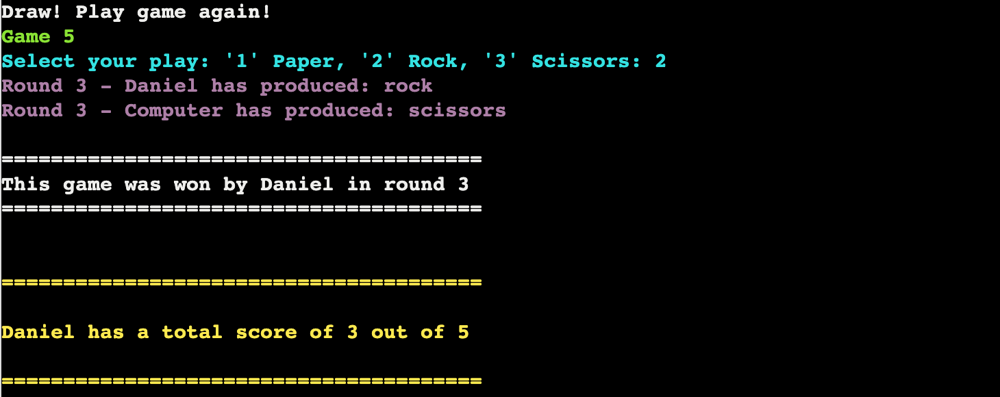

# Rock Paper Scissors
Rock Paper Scissors is a classic two person game. Players start each round by selecting rock, paper or scissors. Rock crushes scissors, scissors cuts paper, and paper covers rock.
In this project the user plays against the computer over five games to see who wins. 

The game is a mixture of luck and logic.

The live link can be found here - [Rock-Paper-Scissors](https://rock-paper-scissors-caro-43b2048bb224.herokuapp.com/)

## How to Play
- The user plays  games of Rock, Paper, Scissors againsts the computer.
- In each game the user can manually select their play (enter 1 for Paper, 2 for Rock and 3 for Scissors)
  - The computer's choice is randomly selected.
  - In the case of a draw i.e. the user and the computer choose the same hand, the game is run again until there is an outright winner.
  - The winner of each game is printed to the terminal.
  - The overall winner after five games have been played is also printed to the terminal.
- The user's score is saved to the leaderboard.

## Site Owner Goals
- To provide the user with a simple game that is both challenging and rewarding.
- To present the user with an app that functions well and is easy to use. 
- To entice the user to return to the game to improve their score.

## User Stories

- ### As a user I want to:
  - Understand the main purpose of the game via the instructions.
  - Be kept engaged throughout with simple graphics/text which show how the game is progressing.
  - Be challenged by trying to beat the computer.
  - See how many games/rounds I have played.
  - Compare my score to others on the leaderboard.
  - Try and beat my score on the leaderboard

## Logic Flow
ADD LUCID FLOW CHART HERE

## Features

### Title and Introduction Section
- When the user enters the site they are greeted with the name of the game and are asked to enter their username. 
- The welcome text was created using Pyfiglet which takes ASCII text and renders it into ASCII art fonts. 

- Once the user enters their name the terminal greets them.
- There is then a three seconds delay before the user is redirected to the options menu.

### Options menu
- The options menu has three possible selections: 1 for Play, 2 for Instructions and 3 for Leaderboard.

- If the user does not input 1, 2 or 3 they will receive an error message asking them to input a valid option.

### Instructions
- If the user presses "2" and enter they will be shown the game instructions. 
- The instructions are surrounded by a box border to make them clear and easy to read. 
- From the instructions menu you can either select play by pressing 1 or quit by pressing 2.

### Leaderboard
- If the user presses "3" and enter they will be taken to the leaderboard. 
- From the leaderboard you can either select play by pressing 1 or quit by pressing 2.

### Game Features
- Once the user selects to play the game, game 1 is launched and the user will be asked to select their hand i.e. Paper, Rock or Scissors:

- When the user selects their hand and presses enter their hand is printed to the terminal.
- The computer's random hand selection is also printed to the terminal.
- Based on the selections made the game will decide who won.
- The winner of each game is surrounded by a white border to make it stand out.

### Guess Input Validation and Error Handling
- If the user inputs anything other than 1, 2 or 3 to select a hand an error message will appear.
  -  The error message reads: 'Please enter "1", "2" or "3".
  - Please see below for some examples:

- In the case of a draw i.e. the user and the computer select the same hand the game will run again until there is an outright winner:

### Guess Feedback
- Once all five games have been played the overall winner will be printed to the terminal.
  - This is printed in yellow to make it stand out:

### Option to Restart or Quit
- Once the game is over the user is informed that the leaderboard has been updated.
- They are then given the option to 1. Start Again or 2. Quit

- Restarting will bring the user back to the login page.
- Quitting will bring the user to a gameover screen. 

### Leaderboard
- The Leaderboard feature was created using Google Sheets. The spreadsheet is accessed by the game through the Google Drive and Google Sheets APIs on the Google Cloud Platform.

- Credentials were generated and provided to allow access from the project to Google Sheets. These were added to the cred.json in the .gitignore file to ensure they weren't pushed to my Github repository. They also had to be added to the Config Vars on Heroku to ensure they could be accessed when running the game. 
- The leaderboard is sorted so that the highest score appears at the top. 

